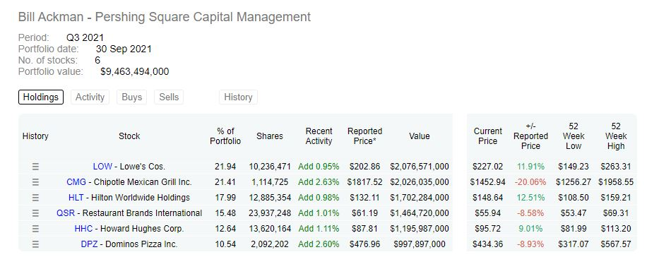

<!-- README.md is generated from README.Rmd. Please edit that file -->

```{r, include = FALSE}
knitr::opts_chunk$set(
  collapse = TRUE,
  comment = "#>"
)
```

# Investment-Portfolio.

<!-- badges: start -->
<!-- badges: end -->


Using R we will obtain an investment portfolio, in this case Bill Ackman's portfolio from https://www.dataroma.com/m/home.php and we will calculate its main statistics such as mean average or return, standard deviation and sharpe ratio, and at the end,  we will optimize the investment portfolio.

```{r, echo = FALSE}

```

## 1.Create the portfolio.

The first step is to create the investment portfolio.
For this we will need 2 vectors:


```{r pressure, echo = FALSE}
tickers = c('LOW', 'CMG', 'HLT', 'QSR', 'HHC', 'DPZ')
weights = c(0.2194,0.2141,0.1799,0.1548,0.1264,0.1054)

tickers
weights
```

## 2. Get historical data.

We will use tidyquant and timetk librarys and the function tq_get,
to obtain the historical data.


```{r , echo = FALSE,warning=FALSE,message=FALSE }
library(tidyquant)
library(timetk)

t1 <- tq_get(tickers)
t2 <- timetk::tk_tbl(t1)

t2

```

## 3. Obtain individual returns.

We will use the function tq_transmute, to obtain the individual returns.

```{r , echo = FALSE,warning=FALSE,message=FALSE }
library(dplyr)
ret_data <- t2 %>%
  group_by(symbol) %>%
  tq_transmute(select = adjusted,
               mutate_fun = periodReturn,
               period = "daily",
               col_rename = "ret")

ret_data

```


## 4. Calculate the combination of stocks in the portfolio.

We will use the function tq_portfolio, to obtain the combinations of stocks.

```{r , echo = FALSE,warning=FALSE,message=FALSE }

port_ret <- ret_data %>%
  tq_portfolio(assets_col = symbol,
               returns_col = ret,
               weights = weights,
               col_rename = 'port_ret',
               geometric = FALSE)

port_ret

```

## 5. Determine the accumulated return of the portfolio.

We will obtain a column that will represent the accumulated return of the portfolio.

```{r , echo = FALSE,warning=FALSE,message=FALSE }

port_ret<-port_ret %>%
  mutate(cr = cumprod(1 + port_ret))


port_ret

```

## 6. Plot the result of the accumulated return.

We will plot the result of the accumulated return with plot_ly.

```{r , echo = FALSE,warning=FALSE,message=FALSE }
library(plotly)
plot_ly(x=port_ret$date, y=port_ret$cr, mode='lines')%>%
layout(title="Accumulated return",xaxis=list(title="Years")
        ,yaxis=list(title="Acc return"),bargap=0.1 )
```

## 7.Annual portfolio returns, volatibility and sharpe ratio.

The average annual portfolio returns using tq_performance.

```{r , echo = FALSE,warning=FALSE,message=FALSE }

average_annual_port_ret<- port_ret %>%
  tq_performance(Ra= port_ret,
                performance_fun=Return.annualized)

cat("The average annual portfolio return is ", round ((average_annual_port_ret[[1]] * 100),2),"%",sep="")

```

The daily portfolio volatility using standard deviation.

```{r , echo = FALSE,warning=FALSE,message=FALSE }

daily_port_sd<- sd(port_ret$port_ret)

cat("The daily portfolio volatibility is" , round ((daily_port_sd),4))
```

The annual portfolio volatility using standard deviation and work days.

```{r , echo = FALSE,warning=FALSE,message=FALSE }

annual_port_sd<- daily_port_sd * sqrt(252)

cat("The annual portfolio volatibility is" , round ((annual_port_sd),4))
```

The annual portfolio sharpe ratio using tq_performance.

```{r , echo = FALSE,warning=FALSE,message=FALSE }

sharpe_ratio <- port_ret %>%
  tq_performance(Ra = port_ret,
                 performance_fun = SharpeRatio.annualized) %>% .[[1]]


cat("The annual portfolio sharpe ratio calculated  is ", round((sharpe_ratio),4))
```


Bill Ackman's portfolio sharpe ratio represents the risk of buying his investment portfolio against the potential return. The sharpe ratio  represents a poor cost (risk) benefit (return) balance because of  the circumstances at the market in March 2020.