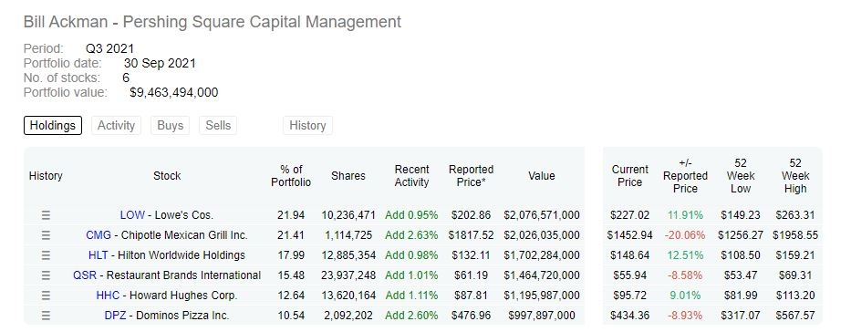
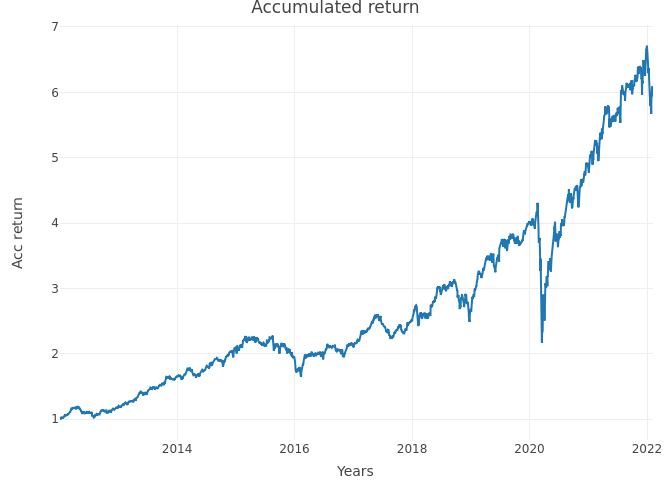

<!-- README.md is generated from README.Rmd. Please edit that file -->

# Investment-Portfolio.

<!-- badges: start -->
<!-- badges: end -->

Using R we will obtain an investment portfolio, in this case Bill
Ackman’s portfolio from <https://www.dataroma.com/m/home.php> and we
will calculate its main statistics such as mean average or return,
standard deviation and sharpe ratio, and at the end, we will optimize
the investment portfolio.

<!-- -->

## 1.Create the portfolio.

The first step is to create the investment portfolio. For this we will
need 2 vectors:

    #> [1] "LOW" "CMG" "HLT" "QSR" "HHC" "DPZ"
    #> [1] 0.2194 0.2141 0.1799 0.1548 0.1264 0.1054

## 2. Get historical data.

We will use tidyquant and timetk librarys and the function tq_get, to
obtain the historical data.

    #> # A tibble: 14,023 × 8
    #>    symbol date        open  high   low close   volume adjusted
    #>    <chr>  <date>     <dbl> <dbl> <dbl> <dbl>    <dbl>    <dbl>
    #>  1 LOW    2012-01-03  25.7  26.0  25.4  25.5 14332300     21.4
    #>  2 LOW    2012-01-04  25.5  26.5  25.5  26.5 19041200     22.1
    #>  3 LOW    2012-01-05  26.4  26.4  26.0  26.4 14015900     22.1
    #>  4 LOW    2012-01-06  26.4  26.5  26.1  26.3 12612900     22.0
    #>  5 LOW    2012-01-09  26.4  26.4  26.0  26.1 12291100     21.8
    #>  6 LOW    2012-01-10  26.3  26.5  26.3  26.4  9626300     22.1
    #>  7 LOW    2012-01-11  26.6  26.6  26.2  26.5 11601900     22.2
    #>  8 LOW    2012-01-12  26.5  26.7  26.1  26.4 16742600     22.1
    #>  9 LOW    2012-01-13  26.3  26.4  26.0  26.3 16140500     22.0
    #> 10 LOW    2012-01-17  26.5  26.9  26.5  26.8 19179400     22.4
    #> # … with 14,013 more rows

## 3. Obtain individual returns.

We will use the function tq_transmute, to obtain the individual returns.

    #> # A tibble: 14,023 × 3
    #> # Groups:   symbol [6]
    #>    symbol date            ret
    #>    <chr>  <date>        <dbl>
    #>  1 LOW    2012-01-03  0      
    #>  2 LOW    2012-01-04  0.0372 
    #>  3 LOW    2012-01-05 -0.00378
    #>  4 LOW    2012-01-06 -0.00114
    #>  5 LOW    2012-01-09 -0.00911
    #>  6 LOW    2012-01-10  0.0126 
    #>  7 LOW    2012-01-11  0.00378
    #>  8 LOW    2012-01-12 -0.00528
    #>  9 LOW    2012-01-13 -0.00265
    #> 10 LOW    2012-01-17  0.0182 
    #> # … with 14,013 more rows

## 4. Calculate the combination of stocks in the portfolio.

We will use the function tq_portfolio, to obtain the combinations of
stocks.

    #> # A tibble: 2,542 × 2
    #>    date        port_ret
    #>    <date>         <dbl>
    #>  1 2012-01-03  0       
    #>  2 2012-01-04  0.0163  
    #>  3 2012-01-05  0.00143 
    #>  4 2012-01-06  0.000145
    #>  5 2012-01-09 -0.00649 
    #>  6 2012-01-10  0.00784 
    #>  7 2012-01-11  0.00806 
    #>  8 2012-01-12 -0.00133 
    #>  9 2012-01-13  0.00133 
    #> 10 2012-01-17 -0.00362 
    #> # … with 2,532 more rows

## 5. Determine the accumulated return of the portfolio.

We will obtain a column that will represent the accumulated return of
the portfolio.

    #> # A tibble: 2,542 × 3
    #>    date        port_ret    cr
    #>    <date>         <dbl> <dbl>
    #>  1 2012-01-03  0         1   
    #>  2 2012-01-04  0.0163    1.02
    #>  3 2012-01-05  0.00143   1.02
    #>  4 2012-01-06  0.000145  1.02
    #>  5 2012-01-09 -0.00649   1.01
    #>  6 2012-01-10  0.00784   1.02
    #>  7 2012-01-11  0.00806   1.03
    #>  8 2012-01-12 -0.00133   1.03
    #>  9 2012-01-13  0.00133   1.03
    #> 10 2012-01-17 -0.00362   1.02
    #> # … with 2,532 more rows

## 6. Plot the result of the accumulated return.

We will plot the result of the accumulated return with plot_ly.

<!-- -->

## 7.Annual portfolio returns, volatibility and sharpe ratio.

The average annual portfolio returns using tq_performance.

    #> The average annual portfolio return is 19.33%

The daily portfolio volatility using standard deviation.

    #> The daily portfolio volatibility is 0.0125

The annual portfolio volatility using standard deviation and work days.

    #> The annual portfolio volatibility is 0.1978

The annual portfolio sharpe ratio using tq_performance.

    #> The annual portfolio sharpe ratio calculated  is  0.9771

Bill Ackman’s portfolio sharpe ratio represents the risk of buying his
investment portfolio against the potential return. The sharpe ratio
represents a poor cost (risk) benefit (return) balance because of the
circumstances at the market in March 2020.
